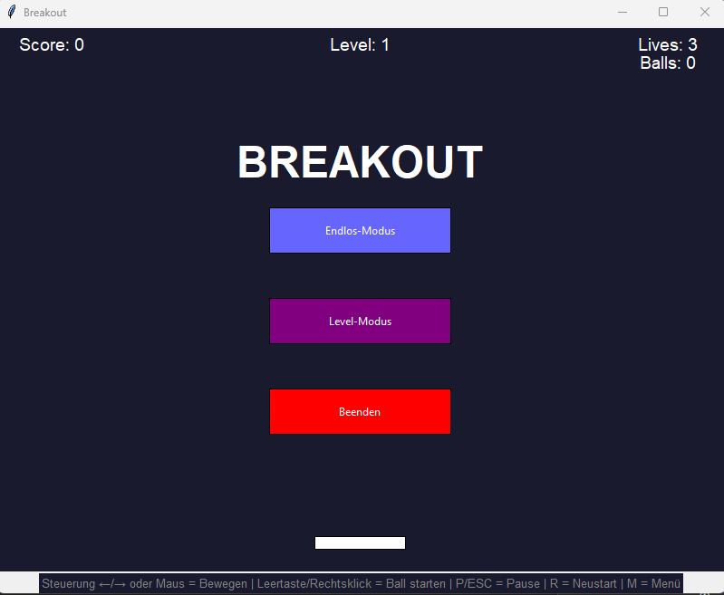
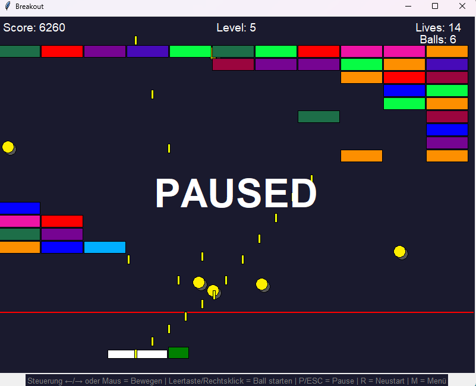
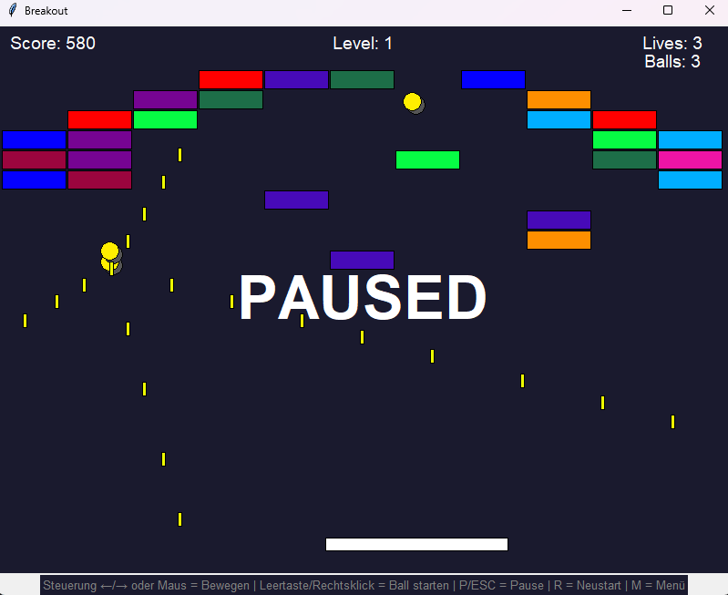
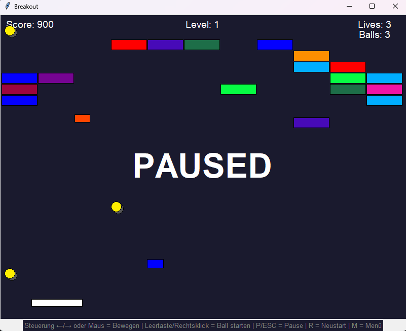

# 🧱 Breakout - Klassisches Arcade-Spiel


Ein vollständiges Breakout-Spiel in Python mit tkinter, entwickelt als Lernprojekt. Das Spiel bietet zwei Spielmodi, verschiedene Power-Ups, Laser-Mechanik und 43 vordefinierte Level!



---

## 📋 Inhaltsverzeichnis

- [Features](#-features)
- [Spielmodi](#-spielmodi)
- [Steuerung](#-steuerung)
- [Power-Ups](#-power-ups)
- [Installation](#-installation)
- [Spielstart](#-spielstart)
- [Projektstruktur](#-projektstruktur)
- [Technische Details](#-technische-details)
- [Screenshots](#-screenshots)
- [Autor](#-autor)
- [Lizenz](#-lizenz)

---

## ✨ Features

### Gameplay
- 🎮 **Zwei Spielmodi** - Endlos-Modus und Level-Modus
- ⚽ **Multi-Ball System** - Bis zu 10+ Bälle gleichzeitig
- ⚡ **5 verschiedene Power-Ups** - Für abwechslungsreiches Gameplay
- 🔫 **Laser-System** - Schieße Laser in alle 4 Richtungen
- 🔥 **Fireball-Modus** - Zerstöre Blöcke mit einem Treffer
- 📈 **Schwierigkeitssystem** - Steigert sich mit deinem Score

### Visuelles
- 🎨 **43 verschiedene Level-Formen** - Buchstaben A-Z, Zahlen 0-9, Symbole
- ✨ **Ball mit Schatten-Effekt** - Für bessere Sichtbarkeit
- 💫 **Pulsierende Power-Ups** - Leicht erkennbar
- 🖱️ **Hover-Effekte** - Interaktive Menü-Buttons
- 🎯 **Farbcodierte Blöcke** - Verschiedene Farben und Trefferpunkte

### Steuerung
- ⌨️ **Tastatur-Steuerung** - Pfeiltasten links/rechts
- 🖱️ **Maus-Steuerung** - Paddle folgt der Maus
- ⏸️ **Pause-Funktion** - Jederzeit pausieren
- 🔄 **Schneller Neustart** - Mit einer Taste neu starten

---

## 🎮 Spielmodi

### ♾️ Endlos-Modus
Im Endlos-Modus spawnen kontinuierlich neue Block-Reihen von oben. Dein Ziel ist es, so viele Punkte wie möglich zu sammeln, bevor die Blöcke die rote "Death-Line" erreichen.

**Besonderheiten:**
- Neue Reihen erscheinen in regelmäßigen Abständen
- Die Spawn-Rate erhöht sich mit steigendem Score
- Die Ball-Geschwindigkeit nimmt zu
- Game Over wenn Blöcke die Death-Line überschreiten

### 🎯 Level-Modus
Im Level-Modus spielst du durch 43 vordefinierte Level. Jedes Level zeigt eine andere Form - Buchstaben, Zahlen oder Symbole.

**Besonderheiten:**
- 43 einzigartige Level-Formen
- Buchstaben A-Z (26 Level)
- Zahlen 0-9 (10 Level)
- Symbole: Herz, Stern, Smiley, Regenbogen, Spirale, Pyramide, Rechteck
- "LEVEL GESCHAFFT" Anzeige nach jedem Level
- Automatischer Fortschritt zum nächsten Level

---

## 🎮 Steuerung

| Taste | Aktion |
|-------|--------|
| `←` / `→` | Paddle nach links/rechts bewegen |
| `Maus` (gedrückt halten) | Paddle folgt der Maus |
| `Leertaste` / `Rechtsklick` | Ball starten |
| `P` / `ESC` | Pause ein/aus |
| `R` | Spiel neustarten |
| `M` | Zurück zum Hauptmenü |

---

## ⚡ Power-Ups

Power-Ups erscheinen zufällig wenn Blöcke zerstört werden. Sie pulsieren und fallen langsam nach unten - fang sie mit dem Paddle!

| Power-Up | Farbe | Effekt | Dauer |
|----------|-------|--------|-------|
| 💚 **Längeres Paddle** | Grün | Verdoppelt die Paddle-Breite | 5 Sekunden |
| 💙 **Multi-Ball** | Blau | Spawnt 1-10 zusätzliche Bälle | Permanent |
| ❤️ **Extra Leben** | Magenta | +1 Leben | Permanent |
| 🔴 **Laser** | Rot | Schießt Laser in 4 Richtungen | 5 Sekunden |
| 🔶 **Fireball** | Orange | Ball zerstört Blöcke sofort | 5 Sekunden |

---

## 💻 Installation

### Voraussetzungen
- Python 3.x (getestet mit Python 3.12)
- tkinter (ist bei den meisten Python-Installationen bereits dabei)

### Schritte

1. **Repository klonen**
   ```bash
   git clone https://github.com/[DEIN-USERNAME]/breakout.git
   cd breakout
   ```

2. **Oder ZIP herunterladen**
   - Klicke auf "Code" → "Download ZIP"
   - Entpacke das Archiv

### tkinter überprüfen
tkinter ist normalerweise bei Python dabei. Falls nicht:

**Windows:**
```bash
# tkinter ist bei der Standard-Installation dabei
```

**Linux (Ubuntu/Debian):**
```bash
sudo apt-get install python3-tk
```

**macOS:**
```bash
# tkinter ist bei Python von python.org dabei
# Bei Homebrew: brew install python-tk
```

---

## 🚀 Spielstart

```bash
python main.py
```

Oder unter manchen Systemen:
```bash
python3 main.py
```

---

## 📁 Projektstruktur

```
breakout/
│
├── main.py                    # Einstiegspunkt (minimal)
├── game.py                    # Hauptklasse, Game-Loop, Event-Handling
├── game_config.py             # Alle Konstanten und Einstellungen
├── README.md                  # Diese Datei
│
├── components/                # Spiel-Komponenten
│   ├── __init__.py
│   ├── paddle.py              # Schläger-Klasse
│   ├── ball.py                # Ball-Klasse mit Schatten
│   ├── block.py               # Block-Klasse
│   ├── powerup.py             # Power-Up-Klasse mit Pulsieren
│   └── laser.py               # Laser-Klasse
│
├── managers/                  # Verwaltungs-Klassen
│   ├── __init__.py
│   ├── game_manager.py        # Spiellogik, Score, Leben
│   ├── level_manager.py       # Level-Erstellung
│   ├── collision_manager.py   # Kollisionserkennung
│   └── ui_manager.py          # UI, Menü, Pause
│
└── utils/                     # Hilfs-Module
    ├── __init__.py
    └── shapes.py              # 43 Level-Formen als 2D-Arrays
```

---

## 🔧 Technische Details

### Verwendete Technologien
- **Python 3.x** - Programmiersprache
- **tkinter** - GUI-Framework (Canvas für Spielgrafik)

### Architektur
Das Spiel verwendet eine **modulare Architektur** mit klarer Trennung:
- **Components** - Einzelne Spielobjekte (Ball, Paddle, etc.)
- **Managers** - Verwaltungslogik (Kollision, Level, UI)
- **Utils** - Hilfsfunktionen und Daten

### Spielschleife
- **Frame Rate:** ~50 FPS (20ms pro Frame)
- **Kollisionserkennung:** Rechteck-zu-Rechteck (AABB)
- **Timer-System:** tkinter `after()` für Game-Loop und Power-Up Dauer

### Konfiguration
Alle Spielparameter können in `game_config.py` angepasst werden:
- Canvas-Größe
- Ball-/Paddle-Geschwindigkeit
- Power-Up Dauer und Spawn-Chance
- Farben und Schriftarten
- Level-Reihenfolge

---

### Hauptmenü


### Endlos-Modus


### Level-Modus


### Power-Ups in Aktion


---

## 🎓 Lernprojekt

Dieses Spiel wurde als Lernprojekt entwickelt, um folgende Konzepte zu üben:

- ✅ Objektorientierte Programmierung (OOP)
- ✅ GUI-Entwicklung mit tkinter
- ✅ Canvas-Manipulation und Animation
- ✅ Kollisionserkennung
- ✅ Game-Loop Implementierung
- ✅ Event-Handling (Tastatur & Maus)
- ✅ Modulare Projektstruktur
- ✅ Timer und Scheduling

---

## 👤 Autor

**Rosy Warny**

- GitHub: [@dein-username](https://github.com/rwarny)

LinkedIn: [Dein Name](https://linkedin.com/in/rosy-warny-22b665398/) -->

---

## 📄 Lizenz

Dieses Projekt ist unter der MIT-Lizenz lizenziert - siehe die [LICENSE](LICENSE) Datei für Details.

```
MIT License

Copyright (c) 2024 Rosy Warny

Permission is hereby granted, free of charge, to any person obtaining a copy
of this software and associated documentation files (the "Software"), to deal
in the Software without restriction, including without limitation the rights
to use, copy, modify, merge, publish, distribute, sublicense, and/or sell
copies of the Software, and to permit persons to whom the Software is
furnished to do so, subject to the following conditions:

The above copyright notice and this permission notice shall be included in all
copies or substantial portions of the Software.

THE SOFTWARE IS PROVIDED "AS IS", WITHOUT WARRANTY OF ANY KIND, EXPRESS OR
IMPLIED, INCLUDING BUT NOT LIMITED TO THE WARRANTIES OF MERCHANTABILITY,
FITNESS FOR A PARTICULAR PURPOSE AND NONINFRINGEMENT. IN NO EVENT SHALL THE
AUTHORS OR COPYRIGHT HOLDERS BE LIABLE FOR ANY CLAIM, DAMAGES OR OTHER
LIABILITY, WHETHER IN AN ACTION OF CONTRACT, TORT OR OTHERWISE, ARISING FROM,
OUT OF OR IN CONNECTION WITH THE SOFTWARE OR THE USE OR OTHER DEALINGS IN THE
SOFTWARE.
```

---

## 🙏 Danksagung

- Inspiriert vom klassischen Atari Breakout (1976)

---

<p align="center">
  Made with ❤️ and Python
</p>
